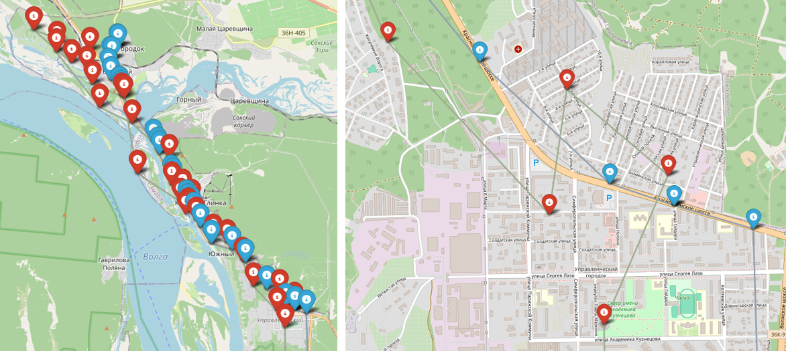

# Приложение для прогнозирования маршрута транспортного средства (ТС) на основе его предыдущих маршрутов
**ВАЖНОЕ ПРИМЕЧАНИЕ: Этот текст не является документацией к коду.** 

_Он служит единственной цели:_ введение в структуру этого
проекта и краткое ознакомление с его функционалом. За более детальными пояснениями советую обратиться к коду. Перед каждой
функцией кратко описано, что она делает и с какими данными, а еще более красноречивым будет лишь сам код.
## Данные

Пример данных в том виде, в котором они поступают из API можно видеть в папке `/data`. 
В ней лежат 3 списка снимков для 3 разных машин по 1000 снимков в каждом файле.

Формат записи:
```
{
    "camera_id": 1,
    "datetime": "2024-12-01T04:00:38.821560+04:00",
    "insertion_time": "2024-12-01T04:01:14.052794+04:00",
    "location": {
      "longitude": 50.191105,
      "latitude": 53.237387
    },
    "driving_direction": 3,
    "image": "photo/9839f77a-cdd5-4b23-8ceb-383ebf40df8c/2024/12/01/1733011238821_EOifjinf_a42a4a49-ef26-5a87-917e-155a170cb686.jpeg",
    "provider_uuid": "9839f77a-cdd5-4b23-8ceb-383ebf40df8c",
    "target_bounding_box": {
      "x1": 0.6471354166666666,
      "y1": 0.5912037037037037,
      "x2": 0.7010416666666667,
      "y2": 0.6222222222222222
    },
    "uuid": "a42a4a49-ef26-5a87-917e-155a170cb686",
    "vehicle": {
      "color": {
        "code": 1,
        "name": "Unknown",
        "description": "Неопределен"
      },
      "country": {
        "code": 167,
        "name": "RU",
        "description": "Россия (Российская Федерация)"
      },
      "model": {
        "code": 66,
        "name": "Chevrolet Aveo"
      },
      "kind": {
        "code": 2,
        "name": "Car",
        "description": "Легковой транспорт"
      },
      "lpn_type": {
        "id": 1,
        "name": "undef",
        "description": "Неопределен"
      },
      "region_code": {
        "code": 0,
        "reg_uuid": "cbf594dd-c2a9-4634-a3c4-826d6f3351ae"
      },
      "license_plate": "*******",
      "license_plate_origin": null
    },
    "velocity": 87,
    "metadata": {
      "lane_id": 2,
      "camera_id": 1,
      "lane_direction": 2,
      "lane_description": "",
      "additional_recognition": false,
      "lane_direction_description": "Oncoming"
    },
    "vlp_recognition_status": "unrecognized"
  }
```

Папка `/secure_data` содержит те же записи, что и папка `/data` с одним единственным отличием. В `/secure_data` 
лежат записи с захешированными номерами, т.е. обезличенные данные. В них захешированы название поля с регистрационным
знаком и само значение этого знака. О функции хеширования будет сказано отдельно.

Папка `/routes` содержит обезличенные записи распределенные по маршрутам. Принято считать, что точки принадлежат
разным маршрутам, если интервал времени между ними 4 часа и больше. Таким образом если JSON файлы в папке `/secure_data`
содержат список объектов (точек) (структура `list[dict]`), то файлы папки `/routes` содержат список списков (маршрутов) 
точек (структура `list[list[dict]]`).

Папка `/light_weight`, если таковая имеется, содержит маршруты из уменьшенных записей. Из исходных данных в данном случае
убираются все поля кроме: дата и время, координаты, скорость, направление движения. Если этой папки нет, значит в папке
`/routes` уже находятся маршруты из уменьшенных записей.

Папка `/reshaped_data` - рудимент. Она использовалась для разделения общих данных по машинам, но вскоре оказалось, что
ответы от сервера приходят и так отсортированные по машинам.

## Код
Код программы разделен по 3 файлам: `data_preprocessing.py`, `prediction_model2.py`, `utils.py`. Каждый из них отвечает
за свою *область*. Причем основная часть программы сосредоточена в файле `prediction_model2.py` и из него запускаются 
основные действия связанные с прогнозированием. В файле `data_preprocessing.py` происходит получение информации из api
сервиса агрегации данных с систем видеонаблюдения. Файл `utils.py` является вспомогательным пакетом и используется внутри
предыдущих двух программ, но сам не запускается.

### data_preprocessing.py
Как можно понять из названия файла, здесь собраны все функции связанные с обработкой данных перед обучением моделей.
Код файла выполняет функции:

- получение данных из api;
- обезличивание данных;
- преобразование даты и времени из строкового формата в datetime;
- преобразование списка точек в маршруты;
- удаление лишних данных из маршрутов;
- сохранение данных в файлы;
- Перевод маршрутов в формат NumPy массивов;
- Создание датасетов из NumPy массивов с данными для обучения в виде одной точки или последовательности;
- Объединение данных с разных файлов.

В каждой функции перед кодом есть пояснение, что она делает и с какими данными оперирует. Надеюсь, описания получились 
исчерпывающие.

### prediction_model2.py
Если предиктивные модели так хороши, то почему нет сиквела? O_O Есть... Первый файл `prediciton_model.py` почивает в 
папке `/draft` вместе с другими версиями этого файла. Итоговой версией на данный момент является `prediction_model2.py`.
В её функции входит:
- Создание кастомной функции ошибки, веса важности которой больше смещены в сторону координат. Т.о. мы пытаемся намекнуть
модели какие параметры нам дороже всего;
- Создание непосредственно модели обучения. Пользователю доступны 3 модели: Dense (полносвязная), LSTM, GXBoostRegressor;
- `main` функция, где осуществляется запуск обучения, выбор модели, определение параметров, сохранение модели, предсказание
и визуализация.

Обученные модели сохраняются в папку `/models`, где их можно различить по названиям. Если нет необходимости переобучать
модель можно загрузить последний сохраненный вариант.

#### Подробнее о моделях обучения
Полносвязная сеть содержит 3 Dense слоя и обучается на данных вида (x, y), где x - точка маршрута, 
y - следующая точка маршрута. Цитата из отчета об итогах обучения полносвязной модели:
>Итогом обучения модели стали относительно неплохие показатели метрик и функции ошибки,
но при этом возникли проблемы с денормализацией. После обучения модели и получения прогноза необходимо привести данные 
в удобочитаемый для человека вид. С этим этапом связка MinMaxScaler и Dense Neural Network справляются плохо. После 
денормализации данных с полновязной нейросети я получил маршруты в рай-оне Африки, что свидетельствует о проблемах с 
интерпретацией выходных данных. С помощью дальнейшей обработки данных удалось приблизить прогноз к необходимым 
координатам, но, как можно видеть на рисунке 1, данная архитектура плохо подходит для решения подобных задач регрессии.


LSTM сеть содержит 1 LSTM и 3 Dense слоя и обучается на данных вида (x, y), где x - последовательности из `n` точек
маршрута, y - следующая точка маршрута. Коротко об итогах обучения модели:
>Результаты обучения данной модели были лучше, чем у полносвязной сети. Значения функции ошибки стали меньше, метрики 
лучше, точки предсказанные алгоритмом находятся ближе к настоящим, но при более детальном рассмотрении становится 
понятно, что эта модель тоже весьма неточная и зачастую ошибается с прогнозом на сотни метров. Визуализация прогнозов 
маршрута ТС от LSTM модели представлена в двух масштабах на рисунке 2.



XGBoost модель. Из библиотеки xgboost был взят класс XGBoostRegressor и быстрым подбором параметров по результатам 
обучения модель была оптимизирована. Данные она обрабатывает такие же, как и Dense модель, т.е. одна точка на входе, одна
на выходе. К сожалению при анализе важности каждого параметра для модели было выявлено, что большую важность для нее имеют
параметры даты и времени нежели координат. Из-за этого предсказания модели все еще остаются неточными, ввиду сложности 
анализируемых данных. Выдержка из отчета об итогах обучения модели:
>Модель продемонстрировала наилучший результат среди 3 моделей. В предсказаниях есть погрешность, но направление 
движения, приблизительное время прибытия на следующую точку она определяет с достаточно высокой точностью, насколько
позволяют данные. Визуализация прогнозов маршрута ТС от LSTM модели представлена в двух масштабах на рисунке 3.


На лучшей модели был протестирован режим предсказания полного маршрута. На вход модели подается точка, она предсказывает
следующую, но следующее предсказание она строит не на следующих входных данных, а на предыдущем предсказании. Стоит ли 
говорить, что точность прогноза в таком режиме падает экспоненциально. Тем не менее следует стремиться к улучшению такого
прогноза, поскольку это и есть прогнозирование маршрута в самом прямом смысле. Визуализация такого подхода к 
прогнозированию маршрута представлена на рисунке 4.


Чтобы **активировать** этот режим, необходимо в функции `evaluatin_visualization` в модуле `utils.py` изменить список
предсказанных точек `predicted_points`, раскомментировав одну строку и закомментировав другую. Кстати о `utils.py`...

### utils.py
В пакет `utils.py` были помещены все вспомогательные функции, которые не относятся напрямую к предобработке данных или 
обучению модели, но которые необходимы для корректной и аккуратной работы других функций. В число функций этого пакета 
входит:
- вычисление расстояния между точками маршрута;
- вывод данных о точке маршрута;
- визуализация маршрута в виде графика библиотеки `matplotlib` (маршрут может быть изображен как на двухмерной плоскости
координат, так и на плоскости координата/время);
- создание случайных цветов (использовалось для выделения настоящего маршрута и предсказанного);
- визуализация настоящего и предсказанного маршрута на интерактивной карте из библиотеки `Folium`;
- построение маршрута по принципу предсказание по предсказанию.

Все функции модуля так же начинаются с пояснений, надеюсь, весьма исчерпывающих.

## Работа с приложением
Цикл работы с приложением на данном этапе следующий:
1. В файле `data_prepricessing.py` в функции `get_lw_routes_from_api` выбираем по какому номеру и какое количество данных
хотим получить, если данных еще нет. Запускаем файл `data_preprocessing.py`.
2. В файле `utils.py` выбираем какие предсказания мы хотим получить (предсказание по датасету/по предыдущему предсказанию).
3. В файле `prediciton_model2.py` прописываем параметры запуска функции `main`. Выбираем модель, выбираем хотим обучать её
или получить предсказание из сохраненной модели, выбираем число точек из тестовых данных, которое хотим отобразить на карте.
Запускаем файл `prediciton_model2.py`.
4. По завершении обучения модели и/или предсказания карту с маршрутами можно найти в файле `prediction.html`.

## TODO
Что осталось недоделанным или не сделанным вовсе, на что стоит обратить внимание при продолжении проекта:
- Файл `data_preprocessing.py` доделывался в спешке, поэтому во многих функциях в нем не хватает параметров, точно
необходим рефакторинг;
- Необходима более тщательная работа с данными. Несколько снимков может быть сделано на одном перекрестке разными камерами,
из-за чего машина по мнению программы проезжает по нему зигзагом. 
- Данные зачастую обрывочны, поскольку компания имеет
открытый доступ к небольшому числу камер. Из-за этого появляются такие отрезки, что машина на одном конце в Самаре, а на
другом уже в Тольятти. Эти и возможно какие-то другие неточности данных необходимо устранять, поскольку они сильно мешают
обучению.
- Стоит развивать модели, использующие последовательности в качестве входных данных, поскольку определить дальнейший маршрут
ТС по ОДНОЙ точке может быть сложной и непонятной задачей для алгоритма.
- Смещение весов XGBoost модели в сторону времени также понижает эффективность работы алгоритма.
- Данные для обучения представлены в формате NumPy, возможно в целях лучшей наглядности и упрощения работы с данными лучше
будет использовать Pandas DataFrames.
- Если планируется развитие XGBoost модели, стоит рассмотреть переход на более удобный для него формат DMatrix. Возможно
с ним можно будет добиться нужного смещения весов значимости признаков.

## Черновики (`/draft`)
В папке `/draft` сохранены файлы с другими вариантами моделей, которые были отброшены по тем или иным причинам. Там и 
модель предсказания маршрута по предыдущим маршрутам (не точка по точкам, а именно маршрут по маршрутам), и неудачные 
модели полносвязных сетей *(нынешнюю тоже сложно назвать удачной, конечно)* и модели сгенерированные моим напарником в 
deepseek'е ( угадайте в каком файле ;) ), и сортировки JSON файлов, проведенные до того как я понял, что данные уже
отсортированы. В общем весь прогресс оставшийся за рамками конечного кода попал в эту папку.

# Прощание
Надеюсь всякий, кто прочитал этот текст, нашел его в хотя бы в какой-то мере полезным для себя. Мне будет очень приятно,
если кто-то сможет продолжить и развить начатый мной проект. Если данное введение прочитано именно с этой целью, желаю
удачи и надеюсь у вас все получится.

